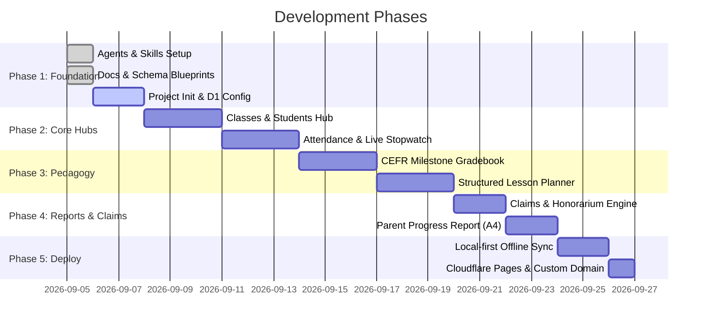

# Development Roadmap — ClassQue-TeachAssist

---

## 🗺️ Milestone Breakdown

---

## 🎯 Phase Descriptions

### Phase 1: Foundation & Infrastructure (Completed / In Progress)
- [x] Multi-agent skill setup (`.agents/skills/`).
- [x] Comprehensive PRD, Architecture, and Lessons Learned reference docs.
- [x] Production-grade D1 SQL schema definition (`docs/DATABASE_SCHEMA.sql`).
- [ ] Initialize frontend bundle & Wrangler configuration.

### Phase 2: Core Teacher Hub & Live Cockpit
- [ ] Build **Today's Cockpit** (Dashboard with next class, stopwatch, active tasks).
- [ ] Build **Classes & Students Hub** (Cohorts management, student profiles, notes).
- [ ] Build **Attendance Engine** (Fast 1-click status toggling, history log).

### Phase 3: CEFR Gradebook & Lesson Planner
- [ ] Implement CEFR Competency framework & 4-stage micro-evaluations.
- [ ] Implement 5-stage Lesson Planner with vocabulary/grammar banks and resource attachments.

### Phase 4: Claims & Parent Reporting
- [ ] Build Teaching Claims calculation & invoice/claim sheet export.
- [ ] Build Parent Progress Report generator with printable A4 styling and WhatsApp copy formats.

### Phase 5: Cloudflare Edge Deployment & Offline Sync
- [ ] Integrate local-first IndexedDB buffer with Cloudflare Pages Functions & D1 sync.
- [ ] Deploy live to Cloudflare Pages on custom domain via Wrangler.
